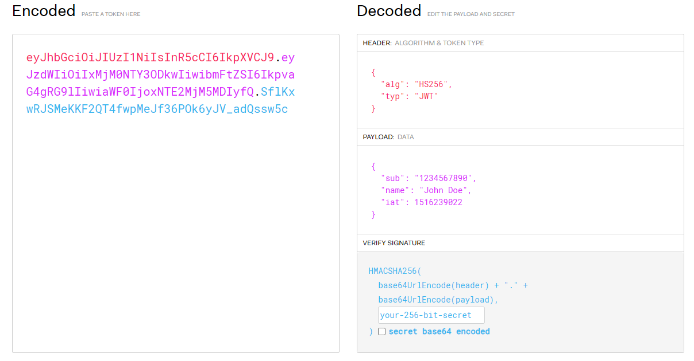

class: inverse, center, middle

# OAuth 2.0, implementációja Keycloakkal és Spring Security-vel

## Viczián István - Training360

---

## OAuth 2.0

* Nyílt szabány **erőforrás-hozzáférés** kezelésére (Open Authorization)
* Autorizációra koncentrál (hozzáférés erőforráshoz, pl. API-hoz), és nem az autentikációra
* Fő használati területe a web, de kitér az asztali alkalmazásokra, mobil eszközökre, okos eszközökre, stb.
* **Elválik**, hogy a felhasználó hol jelentkezik be és milyen szolgáltatást kíván igénybe venni
  * Google, GitHub, Facebook vagy saját szerver
* Access Tokent használ arra, hogy a felhasználó bejelentkezett
  * *Formátumát* nem specifikálja, de gyakran JSON Web Token (JWT), melybe adat menthető

---

## OpenID Connect

* OAuth 2.0 csak authorizáció, OpenID Connect **autentikáció** (ki vagyok, és ezt bizonyítom)
* OpenID Connect 1.0 is a simple identity layer on top of the OAuth 2.0 protocol
* Single sign-on
* Különböző rendszereknek különböző adatokat mutat

---

## OAuth 2.0 Grant Types

* Authorization Code: klasszikus mód, ahogy egy webes alkalmazásba lépünk Facebook vagy a Google segítségével,
Authorization Code kerül vissza, mellyel lekérhető háttérben az Access Token
* **Authorization Code Grant with Proof Key for Code Exchange (PKCE)**: mint az Authorization Code, de egy plusz lépéssel, hogy biztonságosabb legyen mobil/SPA alkalmazásoknál - OAuth 2.1-ben már webes alkalmazásoknál is kötelező lesz
* Client Credentials: ebben az esetben nem a felhasználó kerül azonosításra, hanem az alkalmazás önmaga
* Device Authorization Flow: korlátozott eszközökön, pl. okostévé
* Refresh Token: új Access Token lekérése Refresh Tokennel

Deprecated:

* Implicit: mobil alkalmazások, vagy SPA-k használják, Access Tokent kap azonnal (deprecated)
* Resource Owner Password Credentials: ezt olyan megbízható alkalmazások használják, melyek maguk kérik be a jelszót, nem kell átirányítás (deprecated)

---

## Authorization Code Grant Types lépések

---

## További paraméterek

---

## Paraméterek leírása

* `state`: CSRF támadás ellen, átirányítás előtt elmenti (pl. session), majd visszairányításnál visszakapja és ellenőrzi (OAuth 2.0 protokoll része)
* `nonce` (OpenID Connect része) - client generálja, auth server beleteszi a tokenbe, amit a client ellenőrizni tud 

---

## PKCE

* ejtsd: "pixie"
* CSRF és authorization code injection **elleni védelemre**
* Public client: mobil alkalmazások, SPA alkalmazások, ahol a client secret nem tárolható
* Confidental client: webes alkalmazás, ennél is ajánlott

---

## PKCE lépések

---

## PKCE paraméterek leírása

* Bejelentkezés előtt a kliens generál egy véletlen kódot: `code_verifier`
* Ebből készít egy `code_challenge`-t, SHA-256 hash algoritmussal
* Authorization Code kérésekor elküldi paraméterben, Base64 és URL encode után:
  * `code_challenge`
  * `code_challenge_method`: `S256`
* Mikor a code használatával tokent kér le, ezt is el kell küldenie `code_verifier` (form) paraméterként

---

## Tokenek

* Access Token, OAuth 2.0 a token formátumát nem specifikálja
* **Bearer** ("vivő") token - ezzel fér hozzá erőforráshoz, és nem a titkos credentiallel (pl. jelszó)
* Tipikusan `Authorization` fejlécben
* Opaque token: a benne lévő információhoz a felhasználója nem fér hozzá közvetlenül, ezzel tudja lekérni az auth servertől
* **Non-opaque token**: benne lévő információhoz hozzá lehet férni

---

## JWT token

* Két Base64 enkódolt JSON dokumentum: fejléc, törzs
* Elektronikusan aláírt
* Törzsben a mezők: **claim**
  * Szabványos és egyedi claimek

---

## További tokenek

* **Refresh Token**: ha lejár az Access Token, segítségével új Access Token kérhető le 
* **Identity Token**: felhasználó adatai

---

## Keycloak

* Open Source Identity and Access Management
* **Autorizáció és autentikáció** rábízható (pl. felhasználók tárolása, password policy, e-mail küldés)
* Multi-Factor Authentication (MFA)
* Strong Authentication (SA), pl. OTP (One time password), WebAuthn, céleszközök használata anélkül, hogy az alkalmazást fel kéne készítenünk
* SSO, Single Logout
* Identity Brokering
  *  OpenID Connect vagy SAML 2.0 Identity Providers
  *  Social Login
* User federation
  * Active Directory, LDAP, Relational database

---

## Keycloak

* Webes admin console
* CLI és REST API
* Account management console
* Audit naplózás
* Multitenancy - több szeparált felhasználói csoport/szervezet (realm)
* Clusterelhető
* Könnyen integrálható, hiszen **szabványos** (pl. Spring Security)
* Könnyen kiegészíthető
  * Custom authentication mechanism
  * Custom user stores
  * Custom manipulation of tokens
  * Own custom login protocols
